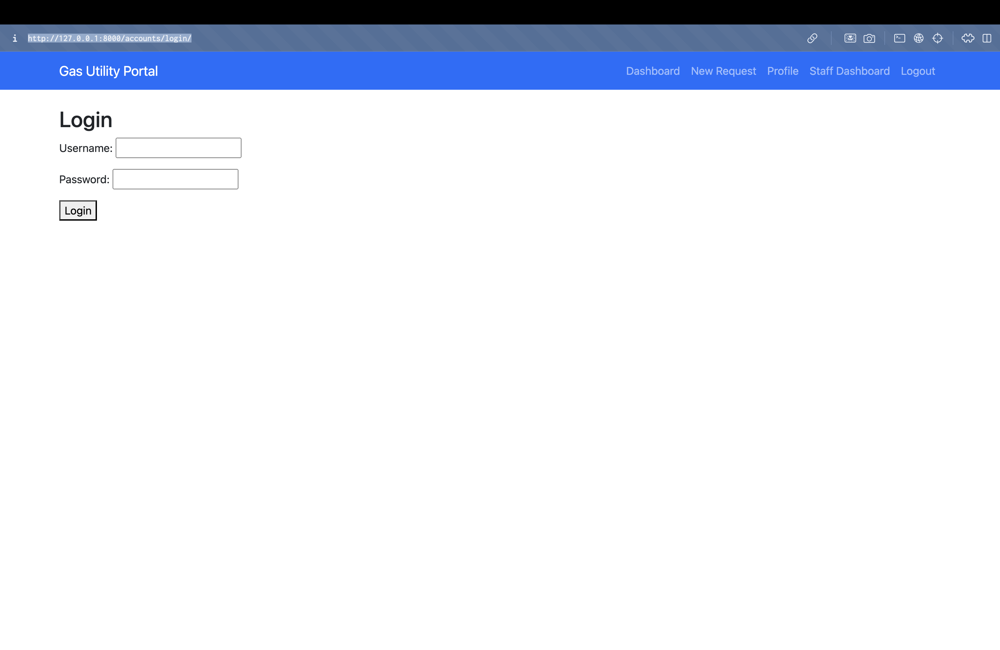

# Gas Utility Service Management System

A Django-based web application for managing customer service requests in a gas utility company. This system streamlines the service request process, reduces wait times, and improves overall customer service efficiency.

## Features

### For Customers
- **Service Request Submission**
  - Submit service requests online
  - Select from various service request types
  - Add detailed descriptions
  - Upload supporting documents/attachments
  - Real-time submission confirmation

- **Request Tracking**
  - Monitor current request status
  - View submission timestamps
  - Track resolution progress
  - Access request history
  - Receive status update notifications

- **Account Management**
  - View account details
  - Update personal information
  - Access service history
  - Manage communication preferences

### For Customer Support Representatives
- **Request Management Dashboard**
  - View all incoming requests
  - Sort and filter requests
  - Assign priority levels
  - Update request status
  - Add internal notes
  - Track resolution times

## Project Structure
```
project_name/
├── app1/                  # Main application directory
│   ├── models.py         # Data models
│   ├── views.py          # View logic
│   ├── urls.py           # URL patterns
│   ├── templates/        # HTML templates
│   ├── static/           # App-specific static files
│   ├── admin.py          # Admin interface
│   ├── apps.py          # App configuration
│   ├── tests.py         # Unit tests
│   └── migrations/       # Database migrations
├── common/               # Shared functionality
│   ├── utils.py         # Utility functions
│   ├── forms.py         # Shared forms
│   └── models.py        # Common models
├── config/               # Project configuration
│   ├── settings.py      # Django settings
│   ├── urls.py          # Main URL routing
│   └── wsgi.py          # WSGI configuration
├── media/               # User-uploaded files
├── static/              # Global static files
├── templates/           # Global templates
└── requirements.txt     # Project dependencies
```

## Installation

1. Clone the repository:
```bash
git clone [repository-url]
cd gas-utility-service
```

2. Create and activate virtual environment:
```bash
python -m venv venv
source venv/bin/activate  # On Windows: venv\Scriptsctivate
```

3. Install dependencies:
```bash
pip install -r requirements.txt
```

4. Configure the database:
```bash
python manage.py migrate
```

5. Create a superuser:
```bash
python manage.py createsuperuser
```

6. Run the development server:
```bash
python manage.py runserver
```

## Configuration

1. Update `config/settings.py` with your database credentials
2. Configure email settings for notifications
3. Set up media file storage

## Usage

### Customer Portal
- Access the customer portal at `http://localhost:8000/`
- Register for a new account or login
- Submit and track service requests
- View account information

### Admin Panel
- Access the admin interface at `http://localhost:8000/admin`
- Manage user accounts
- Handle service requests
- Generate reports

## Testing
Run the test suite:
```bash
python manage.py test
```

## Dependencies
- Django 4.x
- Python 3.8+
- Additional requirements listed in `requirements.txt`

## Contributing
1. Fork the repository
2. Create a feature branch
3. Submit a pull request

## License
This project is licensed under the MIT License - see the LICENSE file for details.

## Support
For support and issues, please create a ticket in our issue tracker.

### 1. Admin Portal
This image shows the **Admin Portal** where you can manage users and service requests.


### 2. Login Portal
Here, the **Login Portal** is shown where users can log in to their accounts.



### 3. Adding Service Type
This screenshot demonstrates that you can add a service type for each user.


### 4. Service Progress
This image shows the interface where you can select the progress of the service request.


### 5. Running the Server
This screenshot shows the **python manage.py runserver** command and the server being up.


### 6. Service Request Portal
This image demonstrates the **Complete Service Request Portal**.


### 7. User Creation
Finally, this shows how you can create a new user in the portal.


